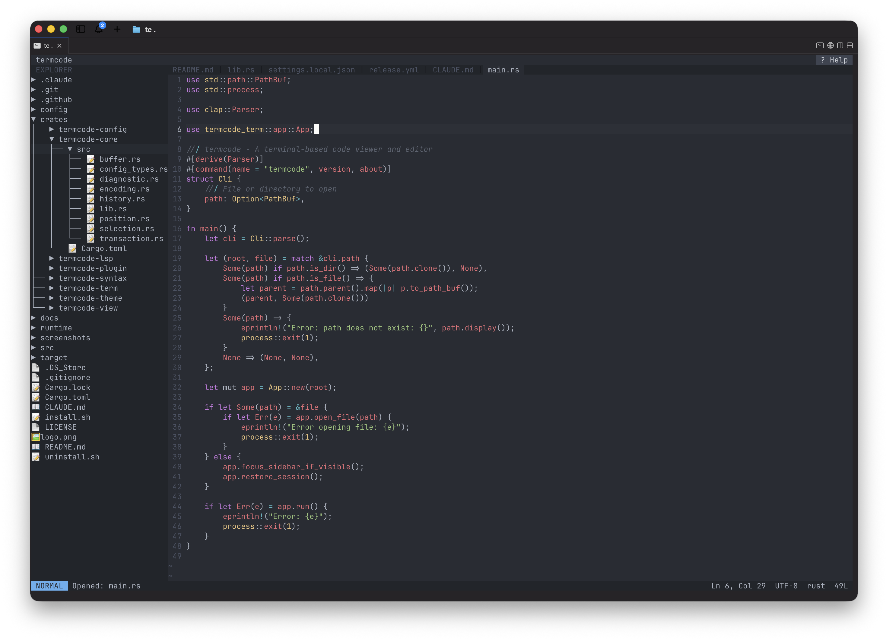

<p align="center">
  
</p>

<p align="center">
  A fast, lightweight terminal code editor built in Rust.
</p>

<p align="center">
  <a href="#installation">Installation</a> &bull;
  <a href="#getting-started">Getting Started</a> &bull;
  <a href="#features">Features</a> &bull;
  <a href="#keybindings">Keybindings</a> &bull;
  <a href="#settings">Settings</a> &bull;
  <a href="#configuration">Configuration</a> &bull;
  <a href="#themes">Themes</a> &bull;
  <a href="#plugins">Plugins</a> &bull;
  <a href="#architecture">Architecture</a> &bull;
  <a href="#contributing">Contributing</a>
</p>

---

<p align="center">
  
</p>

**termcode** is a modern terminal-based code editor that combines the speed of terminal editors with IDE-grade features. Built from scratch in Rust with a modular crate architecture, it delivers native performance, full LSP support, and first-class CJK character handling.

## Highlights

- **Instant startup** -- opens files in milliseconds, not seconds
- **Zero runtime dependencies** -- single static binary, no Node.js, no Electron
- **True IDE features** -- autocompletion, hover docs, go-to-definition, diagnostics
- **CJK-native** -- Korean, Chinese, Japanese characters render correctly everywhere
- **Extensible** -- Lua plugin system with full editor API and lifecycle hooks

## Installation

termcode is a single binary plus a `runtime/` directory (themes, keymaps,
plugins, tree-sitter queries). Both are in every release archive; the binary
looks for `runtime/` next to itself first, then in your config directory.

### macOS / Linux

```bash
curl -fsSL https://raw.githubusercontent.com/yyy-studio/termcode/main/install.sh | sh
```

The installer detects your platform, downloads the latest release, and puts

| What            | Where                        |
| --------------- | ---------------------------- |
| Binary          | `~/.local/bin/termcode`      |
| Runtime         | `~/.config/termcode/runtime/` |
| Config          | `~/.config/termcode/config.toml` |

On a **first** install it asks a few questions (theme, tab size, line numbers,
mouse, sidebar, tree style, icons, `.gitignore`) and writes the answers to
`config.toml`. On a re-install your existing config is left alone and only the
binary and runtime are replaced.

If `~/.local/bin` is not on your `PATH`, the installer says so; add it to your
shell profile:

```bash
export PATH="${HOME}/.local/bin:${PATH}"
```

On macOS the installer also clears the quarantine attribute and ad-hoc signs the
binary, so Gatekeeper does not block it. If you install manually instead, do the
same:

```bash
xattr -c ./termcode && codesign --force --sign - ./termcode
```

`curl` and `tar` are the only requirements. Linux binaries are glibc builds
(`*-unknown-linux-gnu`); on a musl-only distro such as Alpine, build from source.

### Windows

There is no install script. Download
`termcode-x86_64-pc-windows-msvc.zip` from
[Releases](https://github.com/yyy-studio/termcode/releases), then:

```powershell
# Unpacks to %LOCALAPPDATA%\Programs\termcode-x86_64-pc-windows-msvc\
Expand-Archive termcode-x86_64-pc-windows-msvc.zip -DestinationPath "$env:LOCALAPPDATA\Programs"
```

Keep `termcode.exe` and the `runtime/` folder **side by side** -- that is the
first place the binary looks. Then add the folder to your `PATH`:

```powershell
[Environment]::SetEnvironmentVariable(
  "Path",
  "$env:Path;$env:LOCALAPPDATA\Programs\termcode-x86_64-pc-windows-msvc",
  "User")
```

Config lives in `%APPDATA%\termcode\` (`config.toml`, `keybindings.toml`,
`themes\`, `plugins\`), and there is no interactive setup -- write
`config.toml` yourself from the example under [Configuration](#configuration),
or change settings in the app with `F2`.

**Windows Terminal is recommended.** The classic console host handles emoji and
true color poorly; if the file tree icons look misaligned, set
`show_file_type_emoji = false` under `[ui]` for an ASCII tree.

### Pre-built binaries

Download from [GitHub Releases](https://github.com/yyy-studio/termcode/releases):

| Platform              | Download                                    |
| --------------------- | ------------------------------------------- |
| macOS (Apple Silicon) | `termcode-aarch64-apple-darwin.tar.gz`      |
| macOS (Intel)         | `termcode-x86_64-apple-darwin.tar.gz`       |
| Linux (x86_64)        | `termcode-x86_64-unknown-linux-gnu.tar.gz`  |
| Linux (ARM64)         | `termcode-aarch64-unknown-linux-gnu.tar.gz` |
| Windows (x86_64)      | `termcode-x86_64-pc-windows-msvc.zip`       |

Each archive contains the binary and a `runtime/` directory. Unpacked together,
they run from anywhere -- no installer needed.

### From source (requires Rust 1.85+)

Works on all three platforms:

```bash
git clone https://github.com/yyy-studio/termcode.git
cd termcode
cargo install --path .
```

`cargo install` copies only the binary, so point termcode at the runtime as
well -- copy the repository's `runtime/` next to the installed binary, or into
your config directory:

```bash
# macOS / Linux
mkdir -p ~/.config/termcode && cp -r runtime ~/.config/termcode/
```

```powershell
# Windows
Copy-Item -Recurse runtime "$env:APPDATA\termcode\runtime"
```

Without it the editor still starts, but ships no themes, keymap presets or
syntax queries.

## Features

### Editor

| Feature                 | Details                                                                                      |
| ----------------------- | -------------------------------------------------------------------------------------------- |
| **Modal editing**       | 7 modes -- Normal, Edit, File Explorer, Search, Fuzzy Finder, Command Palette, Settings; the default keymap is modeless |
| **Syntax highlighting** | Tree-sitter based -- Rust, Python, JS, TS, Go, C, C++, HTML, CSS, Bash, TOML, JSON, Markdown |
| **LSP integration**     | Autocomplete, hover info, go-to-definition, real-time diagnostics                            |
| **Fuzzy file finder**   | `Ctrl+P` -- fast fuzzy search with smart scoring                                             |
| **Search & Replace**    | `Ctrl+F` / `Ctrl+H` -- case-insensitive, match counter, replace all                          |
| **Command palette**     | `F1` / `Alt+X` -- searchable command list, plus theme and keymap switchers                   |
| **Settings screen**     | `F2` -- edit themes, keymaps, editor options and keybindings; saved to `config.toml`         |
| **Multi-tab**           | Open multiple files, navigate with `Alt+Left/Right`, close with `Ctrl+W`                     |
| **Unsaved protection**  | Confirmation dialog on close/quit when files have unsaved changes -- keyboard or mouse       |
| **File explorer**       | `Ctrl+B` -- tree sidebar with a toolbar, `.gitignore` awareness, and `..` to walk up         |
| **Image viewer**        | View images in tabs -- PNG, JPG, GIF, BMP, WebP, ICO, TIFF, AVIF                             |
| **Lua plugins**         | Custom commands, editor API, hook system                                                     |
| **Undo/Redo**           | Branching history with full transaction support                                              |
| **Mouse support**       | Click, drag select, scroll wheel, tabs, top bar and explorer buttons, dialog buttons          |

### Under the Hood

| Feature              | Details                                                             |
| -------------------- | ------------------------------------------------------------------- |
| **Rope buffer**      | O(log n) edits via `ropey` -- handles large files efficiently       |
| **Atomic saves**     | Write-to-temp + rename prevents data loss on crash                  |
| **Encoding**         | UTF-8, UTF-16 LE/BE, BOM detection, auto line-ending (LF/CRLF)      |
| **Unicode width**    | Full-width CJK characters, combining marks, emoji handled correctly |
| **System clipboard** | Copy/Cut/Paste via system clipboard (`Ctrl+C/X/V`)                  |
| **Diagnostics**      | Inline underlines, gutter icons, error/warning navigation           |
| **True color**       | 24-bit RGB color rendering                                          |

## Getting Started

### Launch

```bash
termcode path/to/file.rs    # Open a file
termcode .                   # Open directory in file explorer
termcode                     # Empty editor
```

### Options

| Flag              | Description   |
| ----------------- | ------------- |
| `-h`, `--help`    | Print help    |
| `-V`, `--version` | Print version |

### Quick Workflow

1. **Open a project** -- `termcode .` to start with the file explorer
2. **Navigate files** -- `Ctrl+B` to toggle sidebar, `Ctrl+P` to fuzzy find
3. **Edit** -- just type: the default keymap has no modal layer (with a modal preset, `i` enters Edit mode and `Esc` leaves it)
4. **Save** -- `Ctrl+S`
5. **Search** -- `Ctrl+F` to search, `Ctrl+H` to search & replace
6. **Tabs** -- open multiple files, switch with `Alt+Left` / `Alt+Right`, close with `Ctrl+W`
7. **Commands** -- `F1` (or `Alt+X`) to open the command palette (theme switch, all commands)
8. **Settings** -- `F2` to change themes, keymaps, editor options and keybindings (see [Settings](#settings))
9. **LSP** -- auto-activates if a language server is configured (see [Configuration](#configuration))
10. **Quit** -- `Ctrl+Q`, or the **^Q Exit** button in the top bar

## Keybindings

Out of the box termcode loads the **`vscode` preset**: no modal layer, VS Code
shortcuts, ready to type. The built-in hybrid keymap (with a Normal mode) and
the other presets are one line of config away -- see
[Keymap Presets](#keymap-presets).

Every keymap here replaces the whole map, so the tables below are per preset,
not a common baseline with variations. For whichever one you are actually
running, the editor itself is the reference: the **help popup** (`Alt+H` under
the default preset, `F1` / `?` under the built-in one) and the **Keybindings
page of [Settings](#settings)** (`F2`) both list the keys the *active* keymap
binds, including anything your `keybindings.toml` added on top.

### Default keys (`vscode` preset)

| Key                        | Action                          |
| -------------------------- | ------------------------------- |
| Any character              | Insert at cursor                |
| Arrow keys / `Home` `End`  | Move cursor                     |
| `Ctrl+Left` / `Ctrl+Right` | Move by word                    |
| `Ctrl+Home` / `Ctrl+End`   | Document start / end            |
| `Ctrl+A` / `Ctrl+E`        | Line start / end (readline)     |
| `Ctrl+S`                   | Save                            |
| `Ctrl+P`                   | Fuzzy file finder               |
| `F1` / `Alt+X`             | Command palette                 |
| `F2`                       | Settings                        |
| `Ctrl+F` / `Ctrl+H`        | Search / Search & Replace       |
| `F3` / `Shift+F3`          | Next / previous match           |
| `Ctrl+B` / `Alt+B`         | Toggle file explorer            |
| `Ctrl+K`                   | Delete line                     |
| `Ctrl+Z` / `Ctrl+U`        | Undo                            |
| `Ctrl+Y`                   | Redo                            |
| `Ctrl+C` / `Ctrl+X` / `Ctrl+V` | Copy / Cut / Paste          |
| `Alt+Left` / `Alt+Right`   | Previous / next tab             |
| `Ctrl+W`                   | Close tab (confirms if unsaved) |
| `F12` / `Alt+F12`          | Go to definition / hover info   |
| `F8` / `Shift+F8`          | Next / previous diagnostic      |
| `Ctrl+L`                   | Toggle line numbers             |
| `Alt+H`                    | Help                            |
| `Ctrl+Q`                   | Quit (confirms if unsaved)      |

The palette is on `F1`/`Alt+X` rather than `Ctrl+Shift+P`, and the sidebar also
on `Alt+B`, because most terminals cannot tell `Ctrl+Shift+P` from `Ctrl+P` and
tmux claims `Ctrl+B`.

### File Explorer

| Key                          | Action                                |
| ---------------------------- | ------------------------------------- |
| `↑` `↓`                      | Move selection                        |
| `→`                          | Expand the directory in place         |
| `←`                          | Collapse it, or step out to its parent |
| `Enter`                      | Enter the directory (it becomes the root), or open the file |
| `..` row                     | Walk the root up one level            |
| `Ctrl+N` / `Ctrl+Shift+N`    | New file / new folder, named in the tree |
| `Ctrl+C`                     | Copy the absolute path                |
| `F5` / `Shift+F5`            | Refresh the selected folder / the tree |
| `Esc` / `Tab`                | Leave the explorer                    |

With the mouse: a click on the `▶`/`▼` chevron expands the directory in place, a
double click on the name enters it, and the toolbar above the tree holds
**New File / New Folder / Refresh / Copy Path**.

Under a modal preset the same actions are on `j` `k` `l` `h`, `n` `N`, `y` and
`r` `R`.

### Built-in keymap

The two tables below describe the built-in hybrid keymap -- VS Code shortcuts
plus a small modal layer. Select it with an empty preset:

```toml
[keymap]
preset = ""
```

#### Normal Mode

| Key                          | Action                          |
| ---------------------------- | ------------------------------- |
| `h` `j` `k` `l` / Arrow keys | Move cursor                     |
| `0` / `Home`                 | Go to line start                |
| `$` / `End`                  | Go to line end                  |
| `g`                          | Go to document start            |
| `G`                          | Go to document end              |
| `PageUp` / `PageDown`        | Page up / down                  |
| `i`                          | Enter Edit mode                 |
| `x` / `Delete`               | Delete character                |
| `Shift+K`                    | LSP hover info                  |
| `Ctrl+P`                     | Fuzzy file finder               |
| `Ctrl+F`                     | Search                          |
| `Ctrl+H`                     | Search & Replace                |
| `Ctrl+Shift+P` / `:`         | Command palette                 |
| `Ctrl+B`                     | Toggle file explorer            |
| `Ctrl+D` / `F12`             | Go to definition                |
| `Ctrl+Z`                     | Undo                            |
| `Ctrl+Y`                     | Redo                            |
| `Ctrl+S`                     | Save                            |
| `Ctrl+W`                     | Close tab (confirms if unsaved) |
| `Alt+Left` / `Alt+Right`     | Previous / next tab             |
| `]` / `[`                    | Next / previous diagnostic      |
| `Ctrl+C`                     | Copy selection                  |
| `Ctrl+Q`                     | Quit (confirms if unsaved)      |
| `F1` / `?`                   | Help                            |
| `F2`                         | Settings                        |

#### Edit Mode

| Key                    | Action                |
| ---------------------- | --------------------- |
| `Esc`                  | Return to Normal mode |
| Any character          | Insert at cursor      |
| `Backspace` / `Delete` | Delete character      |
| `Enter`                | New line              |
| `Home` / `End`         | Line start / end      |
| Arrow keys             | Move cursor           |

### Keymap Presets

A preset decides the whole keymap. `vscode` is the default; pick another in
`config.toml`:

```toml
[keymap]
preset = "vim"   # "vscode" (default) | "vim" | "helix" | "" for the built-in keymap
```

| Preset   | Style                                                                                    |
| -------- | ---------------------------------------------------------------------------------------- |
| `vscode` | Always in Insert mode, VS Code shortcuts, readline keys (`Ctrl+A`/`Ctrl+E`) while typing |
| `vim`    | Modal, with real multi-key sequences: `gg`, `dd`, `yy`, `gd`, `]d`, `ZQ`                 |
| `helix`  | Modal, `Space` leader plus the `g` / `[` / `]` prefixes                                  |

A preset **replaces** the whole keymap rather than layering on top of it, so it
never inherits a default binding that contradicts it. Your `keybindings.toml`
overrides still apply on top of the preset.

The `vscode` preset has no modal layer: it opens ready to type, `Esc` does not
drop you into a mode with nothing bound, and closing an overlay returns you to
the buffer. A preset opts into that with `[meta] initial_mode = "insert"`.

Since a missing `preset` key means the default, the built-in keymap is selected
by an **empty** value (`preset = ""`) rather than by leaving the key out.

Presets live in `runtime/keymaps/*.toml`; drop your own into
`~/.config/termcode/keymaps/` to add one — that directory is searched first, so
a file there also replaces a shipped preset of the same name.

Switch keymaps for the current session from the command palette
(**Select Keymap**); `[keymap] preset` still decides what loads at startup.
Picking one in [Settings](#settings) (`F2`) writes it to `config.toml` as well,
so it survives a restart.

Two keys are deliberately not preset-controlled:

- `Ctrl+Q` always quits, so a broken keymap can never trap you in the editor.
- Terminal multiplexers and shells claim some keys before termcode sees them.
  Each preset documents where it steps around `Ctrl+B` (tmux prefix), `Ctrl+Z`
  (suspend) and `Ctrl+Shift+P` (indistinguishable from `Ctrl+P` in most
  terminals).

While a multi-key sequence is half-typed, the pending keys show in the status
bar. `chord_timeout_ms` (default 1000 ms) is how long the editor waits for the
next key, measured from the last one. If the sequence is abandoned while you are
typing — into the buffer, the search box, or the finder — the keys are entered as
text rather than lost.

All keybindings are customizable via `keybindings.toml`, which layers on top of
whichever preset is active rather than replacing it. See
[Configuration](#configuration).

## Settings

Press `F2`, click **F2 Settings** in the top bar, or run **Open Settings** from
the command palette, for a screen that edits the configuration in place:

| Category        | What it holds                                                            |
| --------------- | ------------------------------------------------------------------------ |
| **Appearance**  | Theme, keymap preset, sidebar visibility and width, file tree style      |
| **Editor**      | Tab size, spaces vs tabs, line numbers, scroll-off, mouse, chord timeout |
| **Keybindings** | Every command and the keys the *active* keymap binds to it, rebindable in place |
| **Plugins**     | Plugin on/off switches, and the configured LSP servers for reference     |

The screen is three levels deep, and the arrows move between them:

| Key               | Action                                                       |
| ----------------- | ------------------------------------------------------------ |
| `↑` `↓`           | Move within the current level                                |
| `→`               | Step in: categories → settings                               |
| `←`               | Step out: settings → categories, or close an open value list |
| `Enter` / `Space` | Open the selected setting, or flip a switch                  |
| `Esc`             | Close the settings screen                                    |

Nothing is changed by moving over it. A setting with more than two values --
theme, keymap, line numbers, any number -- opens a list, and only `Enter` or
`Space` in that list applies the value. (Stepping a value in place meant
walking to `vim` applied `helix` on the way, which is a good way to lose the
keys you were navigating with.)

**The theme previews as you move through its list**, so you can see each one
before committing, and `←`/`Esc` puts the old one back. No other list previews.

A change takes effect immediately **and** is written to your `config.toml` --
comments and key order in that file are preserved, only the key you changed is
rewritten. Rows marked `*` are read once at startup, so they are saved but need
a restart to take effect.

The Keybindings page follows the keymap you are running, so it shows the
`vscode` keys by default and a different set after switching preset. Switching
preset replaces the whole list; your `keybindings.toml` overrides are re-applied
on top of the new one, and the rows show them too.

To rebind a command, select it and press `Enter`, then type the keys and press
`Enter` again -- multi-key chords like `g g` work, and `Esc` cancels (which is
why `Esc` itself cannot be bound from this screen). Bindings are written to
`keybindings.toml`, into the same section the command already lives in. That
file maps a key to a command and has no way to say "this key should stop
working", so a new binding is _added_ alongside any the keymap already gave the
command; the row lists all of them.

## Configuration

termcode stores all user data under `~/.config/termcode/`:

```
~/.config/termcode/
  config.toml          # editor settings
  keybindings.toml     # custom keybindings
  themes/              # custom themes (.toml)
  plugins/             # Lua plugins
  sessions/            # auto-saved sessions
```

Config is read from one file:

1. `./config/config.toml` -- if a project-local config exists, it is used
2. `~/.config/termcode/config.toml` -- otherwise

The project-local file **replaces** the user config rather than merging into it,
so it has to be complete. Settings saved from the `F2` screen are written back
to whichever of the two was loaded.

### config.toml

```toml
theme = "one-dark"

[editor]
tab_size = 4
insert_spaces = true
line_numbers = "absolute"     # "absolute", "relative", "relative_absolute", "none"
scroll_off = 5
mouse_enabled = true

[ui]
sidebar_width = 30
sidebar_visible = true
tree_style = true             # tree lines in the file explorer
show_file_type_emoji = true
respect_gitignore = true

[keymap]
# preset = "vim"              # "vscode" (default), "vim", "helix"; "" for the built-in keymap
chord_timeout_ms = 1000       # gap allowed between the keys of a chord

[plugins]
enabled = true

[[lsp]]
language = "rust"
command = "rust-analyzer"
args = []

[[lsp]]
language = "python"
command = "pyright-langserver"
args = ["--stdio"]
```

### keybindings.toml

Sections are `[global]` plus one per mode: `[mode.normal]`, `[mode.insert]`,
`[mode.file_explorer]`, `[mode.search]`, `[mode.fuzzy_finder]`,
`[mode.command_palette]` and `[mode.settings]`. Mode bindings win over global
ones, and the overlay modes do not consult `[global]` at all.

```toml
[global]
"ctrl+p" = "fuzzy.open"
"ctrl+f" = "search.open"

[mode.insert]
"ctrl+space" = "lsp.trigger_completion"

[mode.normal]
"g g" = "cursor.home"         # multi-key chords are written with spaces
```

Command IDs are listed in the command palette (`F1`) and on the
Keybindings page of the settings screen. Unknown IDs are logged and skipped.

## Themes

Ships with **4 built-in themes**:

- **One Dark** (default)
- **Gruvbox Dark**
- **Catppuccin Mocha**
- **Lazygit**

Switch themes from the command palette (`F1` > **Select Theme**) for
this session, or from [Settings](#settings) (`F2`) to save the choice as well.

### Custom Themes

Create a `.toml` file in `~/.config/termcode/themes/`:

```toml
[meta]
name = "My Theme"

[palette]
bg = "#1a1b26"
fg = "#c0caf5"

[ui]
background = "bg"
foreground = "fg"
cursor = "#f7768e"
selection = "#283457"
# ... 20+ configurable UI color slots

[scopes]
"keyword" = { fg = "#bb9af7" }
"function" = { fg = "#7aa2f7" }
"string" = { fg = "#9ece6a" }
"comment" = { fg = "#565f89", modifiers = ["italic"] }
```

## Plugins

termcode supports **Lua plugins** for extending editor functionality.

### Capabilities

- **Custom commands** -- register commands accessible from the command palette
- **Editor API** -- read/write buffer text, cursor position, selection, file info
- **Hook system** -- respond to lifecycle events: `on_open`, `on_save`, `on_close`, `on_mode_change`, `on_cursor_move`, `on_buffer_change`, `on_tab_switch`, `on_ready`
- **Status bar** -- display messages from plugins
- **Logging** -- `log.info()`, `log.warn()`, `log.error()`, `log.debug()`

### Example Plugin

```lua
-- ~/.config/termcode/plugins/hello/init.lua

plugin.register_command("greet", "Say hello", function()
    local name = editor.get_filename() or "world"
    editor.set_status("Hello, " .. name .. "!")
end)

plugin.on("on_save", function(ctx)
    log.info("Saved: " .. (ctx.filename or "unknown"))
end)
```

A registered command is exposed in the palette as `plugin.<plugin-name>.<name>`,
so the one above is `plugin.hello.greet`. See `runtime/plugins/example/` for a
working plugin.

## Architecture

termcode is built as **8 modular crates** with strict dependency layers:

```
                    termcode (binary)
                        |
                   termcode-term        (terminal, event loop, ratatui)
                    /        \
           termcode-plugin  termcode-view   termcode-lsp
                |              |               |
          termcode-config  termcode-syntax
                \              /
            termcode-core  termcode-theme
```

| Crate               | Role                                                       |
| ------------------- | ---------------------------------------------------------- |
| **termcode-core**   | Buffer (Rope), Position, Selection, Transaction, History   |
| **termcode-theme**  | Theme loading, color resolution, syntax scope mapping      |
| **termcode-syntax** | Tree-sitter integration, language registry                 |
| **termcode-config** | TOML config & keybinding loading, and saving them back     |
| **termcode-view**   | Editor state, Document, View, commands (frontend-agnostic) |
| **termcode-lsp**    | LSP client, JSON-RPC transport, capability negotiation     |
| **termcode-plugin** | Lua plugin runtime, hook system, editor API bindings       |
| **termcode-term**   | Terminal UI, widgets, event loop, clipboard, LSP bridge    |

> All state changes flow through **Event -> Update -> Render** (TEA architecture). Widgets never mutate state during rendering.

## Contributing

Contributions are welcome! Here's how to get started:

```bash
git clone https://github.com/user/termcode.git
cd termcode
cargo build
cargo test --workspace
```

Before submitting a PR:

```bash
cargo clippy --workspace    # Must be 0 warnings
cargo fmt --check           # Must pass
cargo test --workspace      # Must pass
```

## License

[MIT](LICENSE)
